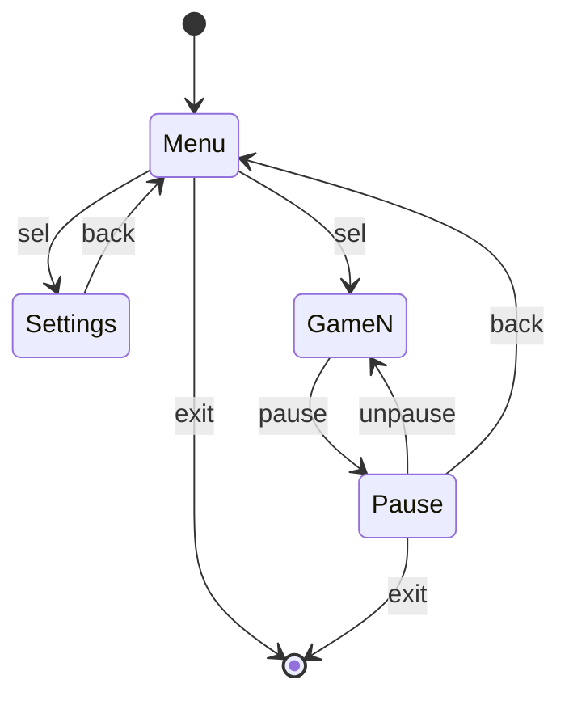
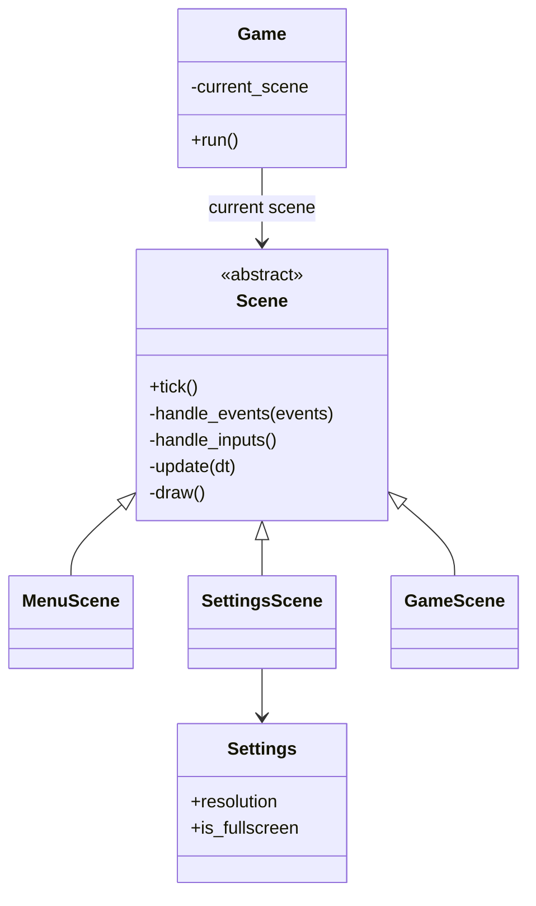

# Game Architecture
## Menu Navigation

```mermaid

stateDiagram
    [*] --> Menu
    Menu --> Settings: sel
    Settings --> Menu : back
    Menu --> GameN : sel
    GameN --> Pause : pause
    Pause --> GameN : unpause
    Pause --> Menu : back
    Menu --> [*] : exit
    Pause --> [*] : exit

```

## Classes

```mermaid

classDiagram
    class Game {
        -current_scene
        +run()
    }

    class Settings {
        +resolution
        +is_fullscreen
    }

    class Scene {
        <<abstract>>
        +tick()
        -handle_events(events)
        -handle_inputs()
        -update(dt)
        -draw()
    }
    
    class MenuScene{
        
    }
    class SettingsScene{

    }
    class GameScene{

    }


    Game --> Scene : current scene
    Scene <|-- SettingsScene
    Scene <|-- MenuScene
    Scene <|-- GameScene
    SettingsScene --> Settings

```
